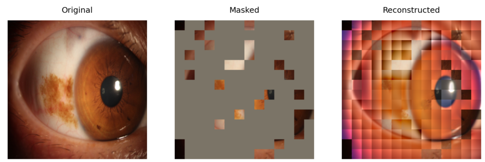

# **OSPM - A Novel SSL-Based Domain-Specific Pretrained Model for Distinguishing Malignant, Premalignant, and Benign Ocular Surface Tumors.**


## Introduction

This repository contains the source code for developing the ocular surface pretrained model (OSPM) and the OSPM-enhanced classification model (OECM). The OSPM is pre-trained on 756,077 unlabeled ocular surface images with Masked Autoencoders([MAE](https://github.com/facebookresearch/mae)), and it has demonstrated efficacy in classifying ocular surface tumors (OSTs) using limited datasets of OST images labeled by histopathological results. For the original pretraining code of Masked Autoencoders, please refer to [MAE](https://github.com/facebookresearch/mae).


## prerequisities & Installation

Create environment with conda
```bash
conda create -n {your_env_name} python==3.8
conda activate {your_env_name}
```

Install dependencies for finetuning
```bash
pip install torch==1.11.0+cu113 torchvision==0.12.0+cu113 torchaudio==0.11.0 --extra-index-url https://download.pytorch.org/whl/cu113
git clone https://github.com/NBeye-research/OSPM.git
cd OSPM
pip install -r requirements.txt
```
* The pretraining code is based on [`timm==0.3.2`](https://github.com/rwightman/pytorch-image-models), for which a [fix](https://github.com/rwightman/pytorch-image-models/issues/420#issuecomment-776459842) is needed to work with PyTorch 1.8.1+.

Install dependencies for explaninability
```bash
pip install matplotlib opencv-python einops timm==0.4.5
```


## Developing OSPM

Organise your data into this directory structure
```bash
├──img_root_path
    ├──file1
        ├──image1
        ├──image2
        ├──...
    ├──file2
        ├──...
    ├──file3
        ├──...
```

To pre-train ViT-Large with single-node distributed training, run the following on 1 node with 6 GPUs each:
```bash
IMAGENET_DIR=/path/to/img_root_path/
OUTPUT_DIR=/path/to/outputs/
LOG_DIR=${OUTPUT_DIR}logs

#large model pretrain
python -m torch.distributed.launch --nproc_per_node=6 main_pretrain.py \
    --batch_size 256 \
    --model mae_vit_large_patch16 \
    --output_dir ${OUTPUT_DIR} \
    --log_dir ${LOG_DIR} \
    --mask_ratio 0.75 \
    --norm_pix_loss \
    --epochs 800 \
    --warmup_epochs 40 \
    --blr 1.5e-4 \
    --weight_decay 0.05 \
    --data_path ${IMAGENET_DIR}
``` 
- Here the effective batch size is 256 (`batch_size` per gpu) * 6 (gpus) = 1536.
- Training time is ~210h in 6 A40 GPUs (800 epochs).


## Developing OSPM-enhanced classification model
To fine tune OSPM on your own data, follow these steps:
### step 1: Download the OSPM Pre-Trained weights
OSPM  [Google Drive](https://drive.google.com/file/d/12TJjSGDVF0npZm0f8OyctMLFhSnDtoXt/view?usp=sharing)


### step2: Organise your data into this directory structure
```bash
├──train
    ├──class_a
    ├──class_b
    ├──class_c
├──val
    ├──class_a
    ├──class_b
    ├──class_c
├──test
    ├──class_a
    ├──class_b
    ├──class_c
``` 
## step3: Run finetuning

Only use the encoder of the OSPM and discard the decoder.
```bash

TRAIN_DIR=/path/to/train_dir
VAL_DIR=/path/to/val_dir
OUTPUT_DIR=/path/to/otputs
ARCH=vit_large_patch16_224
FINETUNE=/path/to/OSPM.pt

python run_class_finetuning.py \
    --arch  ${ARCH} \
    --train_dir ${TRAIN_DIR} \
    --val_dir ${VAL_DIR} \
    --output_dir ${OUTPUT_DIR} \
    --fine_tuning ${FINETUNE} \
    --lr 0.001 \
    --smoothing 0.2 \
    --batch-size 32 \
    --tag OECM  \
    --epochs 50 \
    --gpu 0,1

```


## run test

```bash

EVA_DATA_PATH=/path/to/test_dir
ARCH=vit_large_patch16_224
FINETUNE_PATH=/path/to/finetuned_model.pt

python run_class_finetuning.py \
    --arch  ${ARCH} \
    --val_dir ${EVA_DATA_PATH} \
    --fine_tuning ${FINETUNE_PATH} \
    --batch-size 32 \
    --evaluate \
    --gpu 0,1

```


## Visualization demo

Run the OSPM visualization demo using [OSPM_visualize.ipynb](./OSPM_visualize.ipynb), which is based on [MAE](https://github.com/facebookresearch/mae):
<p align="center">
  
</p>

Run the OECM heatmap demo using [OECM_explaninability.ipynb](./OECM_explaninability.ipynb) , which is based on [Transformer-Explainability](https://github.com/hila-chefer/Transformer-Explainability):
<p align="center">
  
</p>


**Please feel free to contact us for any questions or comments: Zhongwen Li, E-mail: li.zhw@qq.com or Yangyang Wang, E-mail: youngwang666@hotmail.com.**
